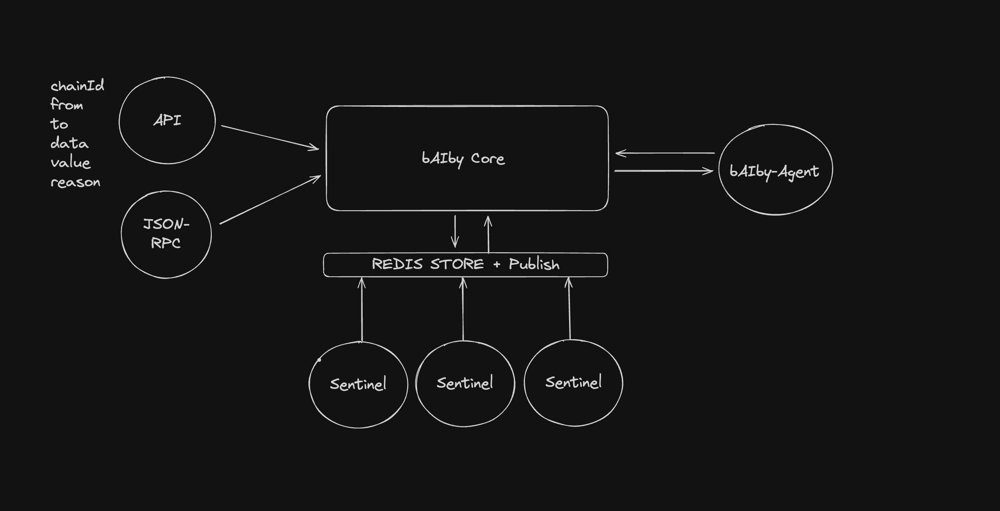

<p align="center">
  
</p>

# bAIby Core

bAIby Core is a blockchain transaction analysis service that uses multiple sentinels to detect patterns and risks.

## Requirements

- Docker
- Docker Compose 
- Python 3.12+

## Setup

1. Clone the repository:
```bash
git clone git@github.com:BaIbySitter/baiby-core.git
cd baiby-core
```

2. Copy environment variables file:
```bash
cp .env-example .env
```

3. Adjust variables in `.env` as needed:
```env
REDIS_URL=redis://redis:6379/0
LOG_LEVEL=INFO
HOST=0.0.0.0
PORT=8000
```

## Running

1. Build and start containers:
```bash
docker-compose up --build
```

2. Service will be available at `http://localhost:8000`

## Usage

### Analyze a transaction

```bash
curl -X POST http://localhost:8000/api/transaction \
  -H "Content-Type: application/json" \
  -d '{
    "chainId": 1,
    "from_address": "0x742d35Cc6634C0532925a3b844Bc454e4438f44e",
    "to_address": "0xC02aaA39b223FE8D0A0e5C4F27eAD9083C756Cc2",
    "data": "0x095ea7b3000000000000000000000000000000000000000000000000000000000000002000000000000000000000000000000000000000000000000000000000000000e0",
    "value": "0",
    "reason": "Approve WETH contract"
  }'
```

Successful response:
```json
{
    "request_id": "c4ede584-5478-4f7b-82fb-8943b3726a5d",
    "status": "completed",
    "results": {
        "warnings": []
    }
}
```

### Available Endpoints

- `POST /api/transaction`: Analyzes a transaction
- `POST /rpc`: RPC endpoint for integrations

## Architecture

The system uses a sentinel-based architecture where each sentinel is responsible for a specific type of analysis:

- **Malicious Address Sentinel**: Checks if an address is blacklisted
- **Transaction Pattern Sentinel**: Analyzes suspicious patterns
- **Network Activity Sentinel**: Monitors unusual network activity

Sentinels communicate through Redis pub/sub and state is maintained in Redis.

## Development

To add a new sentinel:

1. Create a new class in `src/sentinels/` that inherits from `BaseSentinel`
2. Implement the `analyze()` method
3. The sentinel will be automatically discovered and activated

Example:

```python
from src.sentinels.base_sentinel import BaseSentinel

class NewSentinel(BaseSentinel):
    def __init__(self):
        super().__init__()
        self.name = "new-sentinel"

    async def analyze(self, data: dict) -> dict:
        # Implement analysis logic
        return {"risk_level": "low"}
```

# Architecture

<p align="center">
  
</p>

## License

MIT
